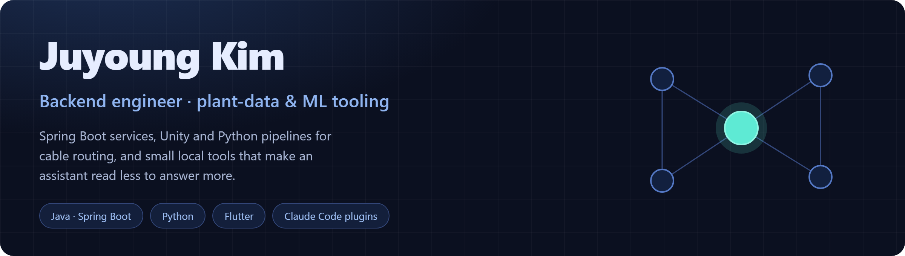
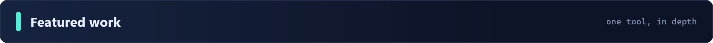
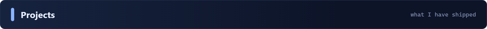
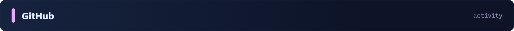
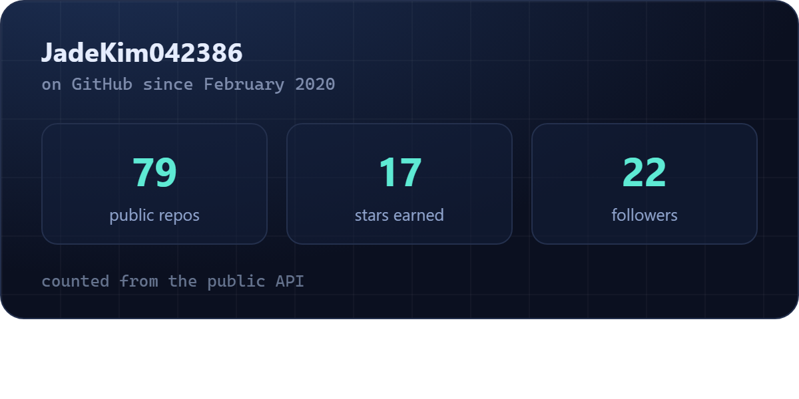
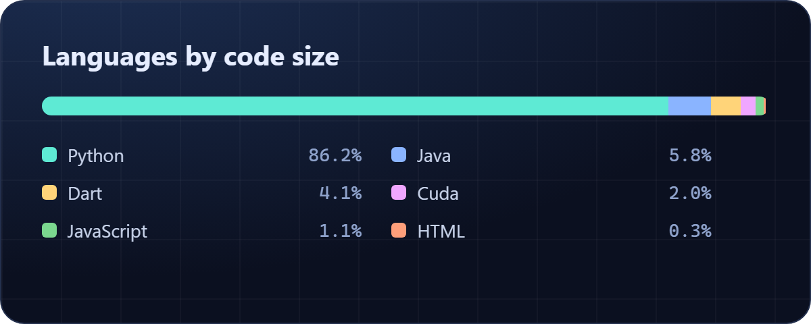
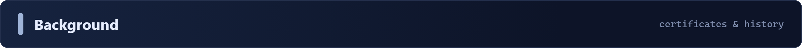
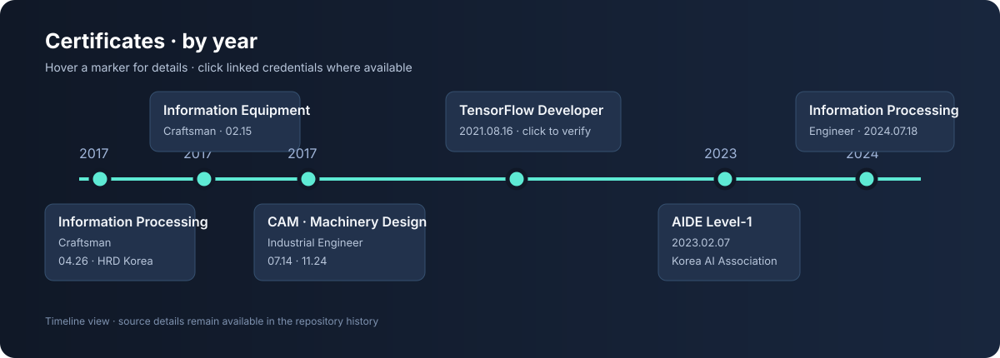

  
  
  

 

### [context-graph](https://github.com/JadeKim042386/context-graph) — evidence-backed knowledge, line by line

A cross-agent <b>Knowledge Engineering Skill</b> for turning Markdown and HTML source material into a reviewable, traceable knowledge base.

<ul>
  <li>🧭 <b>Collects and organizes</b> research sources while preserving provenance</li>
  <li>🔎 <b>Separates claims from evidence</b> so every answer can be checked against its source</li>
  <li>🧠 <b>Analyzes gaps and conflicts</b> before proposing changes</li>
  <li>🤝 <b>Supports review and modification</b> with explicit decisions and reproducible validation</li>
  <li>🔒 <b>Local-first and deterministic</b> — no hidden inference in the graph-building path</li>
</ul>

Works with <b>Codex Skills</b> and the <b>Claude Code plugin</b>. Install the latest <a href="https://github.com/JadeKim042386/context-graph/releases/tag/v0.3.6">v0.3.6 release</a> or explore the source and workflow in the repository.

 

| | Project | Period | Where | State |
|---|---|---|---|---|
| 🧩 **Cross-agent Skill / Claude Code plugin** | [context-graph](https://github.com/JadeKim042386/context-graph) | 2026.08 ~ | Personal | **Active** |
| 🌐 Web service | [Freshtrash Backend](https://github.com/fresh-trash-project/fresh-trash-backend) | 2024.03 ~ 2024.07 | [Freshtrash Team](https://github.com/fresh-trash-project) | Closed |
| 🌐 Web service | [My3D](https://github.com/JadeKim042386/My3d) · [My3D-BACKEND](https://github.com/JadeKim042386/My3d-BACKEND) | 2023.08 ~ 2024.04 | Personal | Paused |
| 📱 Flutter app | [pomotimer](https://github.com/JadeKim042386/pomotimer) | 2023.04 ~ 2023.06 | Personal | Deployed |
| 👁️ Computer vision | [Food Web Service](https://github.com/JadeKim042386/final-project-level3-cv-18) | 2021.11 ~ 2021.12 | Boostcamp AI Tech | Closed |
| 🏆 AI competitions | [Image Classification](https://github.com/JadeKim042386/image-classification-level1-09) · [Object Detection](https://github.com/JadeKim042386/object-detection-level2-cv-17) · [Semantic Segmentation](https://github.com/JadeKim042386/semantic-segmentation-level2-cv-17) · [Model Optimization](https://github.com/JadeKim042386/model-optimization-level3-cv-17) | 2021.08 ~ 2021.12 | Boostcamp AI Tech | Closed |

 

<table width="100%">
  <tr>
    <td width="50%" valign="top" align="center">
      <b>Language</b>  
      
      
      
      
      
    </td>
    <td width="50%" valign="top" align="center">
      <b>Backend</b>  
      
      
      
      
      
      
    </td>
  </tr>
  <tr>
    <td valign="top" align="center">
      <b>Frontend &amp; app</b>  
      
      
      
      
      
    </td>
    <td valign="top" align="center">
      <b>Data &amp; ML</b>  
      
      
      
      
      
    </td>
  </tr>
  <tr>
    <td valign="top" align="center">
      <b>Infra &amp; DevOps</b>  
      
      
      
      
      
      
    </td>
    <td valign="top" align="center">
      <b>Testing &amp; tools</b>  
      
      
      
      
      
    </td>
  </tr>
</table>

 

<table width="100%">
  <tr>
    <td width="50%" align="center">
      
    </td>
    <td width="50%" align="center">
      
    </td>
  </tr>
</table>

 

<b>Certificates · by year</b>

Hover each marker for details. Click linked credentials where available.

<b>History · by year</b>

Hover each marker for details and click linked projects.

